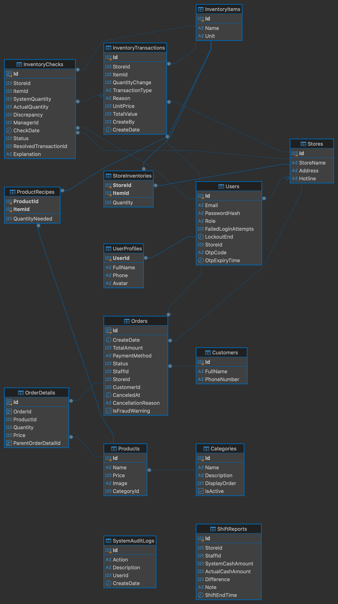

# F&B Loss Prevention & Chain Management API


## Tổng Quan
F&B Loss Prevention API (CoffeeShop) là hệ thống RESTful API hiệu năng cao và có khả năng mở rộng tốt, được xây dựng để phục vụ vận hành chuỗi quán cà phê. Được phát triển trên nền tảng .NET Core và C#.

Hệ thống được thiết kế chặt chẽ theo Kiến trúc phân tầng (N-Tier Architecture), đảm bảo tách biệt rõ ràng các tầng trách nhiệm (Separation of Concerns), tối ưu khả năng bảo trì và sẵn sàng cho việc mở rộng quy mô.

### 🗄️ Kiến Trúc Database Và Đặc Tả

<p align="center">
  <a href="database-erd.png" target="_blank">
    
  </a>
  <br>
  <em>(Nhấp vào ảnh để xem chi tiết ở độ phân giải gốc)</em>
</p>

## Tính Năng
Quản lý Định lượng pha chế (Bill of Materials - BOM): Tự động bóc tách và khấu trừ nguyên liệu thô theo công thức khi xuất bán đồ uống; hỗ trợ topping/món phụ linh hoạt qua cấu trúc self-referencing.

Sổ cái biến động kho bất biến (Append-only Inventory Ledger): Mọi thao tác nhập hàng, hao hụt, bán lẻ đều được ghi nhận dạng lịch sử bất biến (InventoryTransactions), hỗ trợ đối soát sai lệch kiểm kê kho định kỳ.

Cơ chế Cảnh báo gian lận (Loss Prevention & Anti-Fraud): Tự động gắn cờ (IsFraudWarning) đối với các đơn hàng bị hủy bất thường sau khi đã pha chế, ghi nhận nguyên nhân hủy và thời gian hủy để phục vụ thanh tra.

Đối soát kết ca (Z-Report & Cash Reconciliation): Tự động đối soát giữa doanh thu tiền mặt tính toán trên hệ thống và số tiền thực tế bàn giao tại quầy (ShiftReports), cô lập chênh lệch thất thoát theo từng nhân viên.

##  Tech Stack
* **Framework:** .NET (C#)
* **Database:** PostgreSQL (Neon Cloud Serverless)
* **ORM:** Entity Framework Core
* **Authentication:** JSON Web Token (JWT)
* **API Documentation:** Swagger / OpenAPI

## Project Structure
```text
CoffeeShop.Solution/
│
├── Frontend
│   └── CoffeeShop.FrontEnd/ # Lớp Giao diện (UI) gồm các cổng thông tin cho Quản lý và Nhân viên
├── Backend (N-Tier)
│   ├── CoffeeShop.API/      # Lớp Trình Diễn (Controllers, DI Container, Middlewares)
│   ├── CoffeeShop.BLL/      # Lớp Xử lý Nghiệp Vụ (Services, DTOs, JWT Generation)
│   ├── CoffeeShop.DAL/      # Lớp Truy cập Dữ liệu (Repositories, DbContext, Migrations)
│   └── CoffeeShop.Models/   # Lớp Thực Thể (Entities: Auth, Catalog, Sales, System)
│
├── Testing & Tools
│   └── RaceConditionTester/ # Công cụ mô phỏng 10 concurrent requests (Task.WhenAll) nhằm kiểm thử tải và phát hiện xung đột dữ liệu (Lost Update) trong luồng đặt hàng.
│
├── CoffeeShop.sln           # Visual Studio Solution file
└── README.md                # Project documentation
```

## Hướng Dẫn Khởi Chạy (Getting Started)

### Yêu Cầu Hệ Thống (Prerequisites)
* **.NET SDK 8.0** trở lên
* **Node.js** (khuyến nghị v18 trở lên) & **npm**

---

### 1. Khởi Chạy Backend (.NET 8 Web API)
Dự án đã tích hợp sẵn cơ chế **Auto-Migration** và **Data Seeding** tự động kết nối với NeonDB:

```bash
cd CoffeeShop.API
dotnet run
```
* **Swagger UI:** Truy cập theo đường dẫn mặc định hiển thị trên Terminal (thường là `https://localhost:5079/swagger` hoặc `http://localhost:5079/swagger`).

---

### 2. Khởi Chạy Frontend (React / Vite)
Mở một cửa sổ Terminal mới và chạy các lệnh sau:

```bash
cd CoffeeShop.FrontEnd
npm install
npm run dev
```
* **Giao diện Client:** Mặc định truy cập tại `http://localhost:5173`.

---

### 3. Tài Khoản Trải Nghiệm Mẫu (Demo Credentials)

Hệ thống đã nạp sẵn các tài khoản phân quyền mẫu phục vụ quá trình test chức năng:

| Vai trò | Email đăng nhập | Mật khẩu | Chi nhánh |
| :--- | :--- | :--- | :--- |
| **Manager (Quản lý)** | `manager.cg@coffeeshop.com` | `Manager@123` | Cầu Giấy |
| **Staff (Nhân viên)** | `staff1.cg@coffeeshop.com` | `Staff@123` | Cầu Giấy |
| **Manager (Quản lý)** | `manager.dd@coffeeshop.com` | `Manager@123` | Đống Đa |
| **Staff (Nhân viên)** | `staff1.dd@coffeeshop.com` | `Staff@123` | Đống Đa |

---
### 🧪 Kiểm Thử Xung Đột Dữ Liệu (Concurrency Stress Testing)
Dự án tích hợp sẵn CLI tool giả lập tình huống 10 thu ngân cùng bấm thanh toán món hàng cuối cùng trong kho tại cùng một thời điểm:

```bash
cd RaceConditionTester
dotnet run
```

Mục đích: Mô phỏng xung đột dữ liệu (Lost Update) và kiểm tra tính toàn vẹn của tồn kho nguyên liệu dưới tải tương tranh cao.

## Tác Giả (Author)

* **Dương Tiến Chiến** – *Backend Developer*
* **GitHub:** [duongtienchien](https://github.com/duongtienchien)
